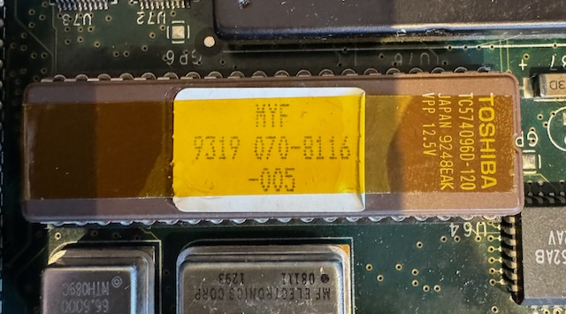

# SGI Iris Indigo R4k (IP20) Troubleshooting

This documents my efforts in troubleshooting the case where my indigo R4k will immediately show a green status light and will progress no further.  There is nothing on the serial console, nothing on the video display, and no startup chime. Some SCSI disks may show signs of life by spinning up, but this is likely just because they are powered on.

The boot process is as follows:
 * LED is green on power up
 * CPU starts POST and sets LED to amber and chimes
 * once POST is complete, CPU sets LED back to green and boot commences

If the LED stays green then something is preventing the CPU from executing. Unfortunately there could be a range of reasons for this

I have two CPU modules, one R4000 which is known bad.  And one R4400 module which was working prior to an extended period of storage

# References
 
These resources may prove useful.  Copies of various pdfs can be found in the docs folder
 * [R4000 User Guide](https://www.eecg.toronto.edu/~moshovos/ACA/R4000.pdf)
 * [Ian's SGI Depot](http://www.sgidepot.co.uk/sgidepot/)
 * [Sgistuff](http://www.sgistuff.net/index.html)
 * [IRIXnet forums](https://forums.irixnet.org)
 * [Vintage Computer Federation forums](https://forum.vcfed.org)
 * [Silicon Graphics User Group forums](https://forums.sgi.sh)
 * [The Nekonomicon](https://gainos.org/~elf/sgi/nekonomicon/index.html)
 * [Indigo Field Service Handbook](https://bukosek.si/hardware/collection/sgi-indigo/indigo-service-manual.pdf)
 * [Andrej Bukosek's SGI collection](https://bukosek.si/hardware/collection.html)

# Minimal configuration

This should be enough for the Indigo to get past the POST stage.  By removing as many things as possible we can focus on the immediate issue.
 * All drives removed
 * Graphics board removed
 * CPU installed
 * GIO boards removed
 * 4 SIMMs installed (any size) into bank A
 * nothing connected except power

## R4000 CPU board
Image for reference, with only Bank A populated with SIMMs

# Steps

## Physical inspection

These machines are old and likely have been through multiple owners / configurations.  Check for signs of physical trauma.  Magnifiers / loupe / optical scope will come in handy
 * Check all connectors and sockets for bent / missing / corroded pins
 * Check for damaged / scorched / missing components and replace if possible
  * One report of expired cap on ZB4 board <link>
  * I had a missing C502 on the underside of my R4400 CPU module.  I replaced this with a 0.1uF and a 10uF ceramic cap, but neither helped 
  * I also had a R4000 CPU module with missing L2 and L5 inductors and damage to the traces.  Seemingly happening after sitting in storage for some time.
 * Damaged traces - especially around the battery area.  This is soldered to the main board and may have already been replaced (maybe more than once)
 * dry solder joints - look for cracking around connector solder joints
  * consider reflowing connections if they look suspect

## Check battery

There has been at least one report of a "dead" indigo due to battery issues.  <link>
 * remove battery if installed and try to boot
 * check voltage and replace if low.  Reports that lithium cells (2.5v) work <link>.  Or replace with a new Tadiran (3.6v)
 * re-install and try to boot

## Physical connections

Deoxit on all sockets / connectors may be a good idea
 * reseat CPU board in chassis
 * reseat CPU module on CPU board
 * reseat all SIMMs
 * reseat PROM on CPU board
 * reseat backplane EEPROM (8 pin)
 * reseat 8 pin EEPROM in CPU module (contains clock multiplier info)
 * check reset switch - at least one report of reset switch being permanently closed <link>
  * Removing the PSU will be required.  There is one screw at the back and the PSU should slide out with a bit of encouragement. 
 
## PSU voltage levels

This is quite tricky to do given the enclosed nature of the machine. But the Field Service Handbook[^4] suggests to use the drive sled power connectors.

With pin 1 at the bottom right hand side as we look at it, 12v is pin 1, 5v is pin2 and GND are pins 6 and 7 (top right hand side).  See the diagram in the linked pdf.

Load is important.  My 12v was reading 2.7v with no CPU main board installed.  5v was reading exactly 5v.  With the main and video boards installed to provide some load, the 12v rail was reading 12.2v

## Tantalum Capacitors
Tantalum capacitors are Yellow, square(ish), and have a red/orange stripe on one end.  When these fail, they cause a short
 * check resistance across each cap and anything below 10 ohm should be treated as suspect
 * remove any suspect caps from the board and check continuity in isolation
  * I had potential bad caps at C41, C40 (31 Ohm in circuit), C513A/B, C578A/B, C645A/B (all 19 Ohm in circuit).  This is unlikely and probably caused by the circuit they are part of.  I may remove and test in isolation
 * replace as needed

## Memory 

 * Try alternate SIMM sets in bank A.  There may be a bad module

## (E)EPROMs

There are multiple non-volatile chips which may be involved here.  They can be dumped using a minipro / TL866 device[^1].  I have captured the contents of the chips from my machine.  They can be found in the roms folder.

To dump the rom to file: `minipro --device NM93CS56 -r r4000_cpu_module.hex`

### Backplane 8 pin EEPROM

2kbit EEPROM, part number 93CS56N[^5] 
Stores the MAC address (anything else?)
 * check that it can be read from and written to using an EEPROM programmer.
 * The machine should write to a blank chip on boot

Using `minipro --device NM93CS56 -E` to erase the device (after dumping the content), it was filled with 256 bytes of 0xFF (<should be all 0x00?>).  When inserted back into the system it made no difference.

### CPU module 8 pin EEPROM

#### R4000

93CS56N - this is the same 2kbit EEPROM as found in the backplane

I dumped the rom [here](roms/r4000_cpu_module.hex)

Only the first 8 bytes are expected to contain anything, on my machine it looks like this: `0C 1E 4A 01 20 A2 B4 00`.  The rest are all zero.

This can be decoded using the R4000 User guide[^2].  These bits are read in serially to the CPU at initialization time.

This module has some very obvious physical damage.  L2 and L5 are completely missing.  I have no idea what values these should be and can't find any documentation / schematics.

#### R4400

93CS56N - this is the same 2kbit EEPROM as found in the backplane

SGI part? 9113-001 02C3 (found on sticker on top of EEPROM)
Stores the CPU clock multiplier and other config
 * check that it can be read from and written to (make a backup first and write this back to the chip when done) 

I dumped the rom [here](roms/r4400_cpu_module.hex)

content starts with these 8 bytes: `0C 0E CA 21 A0 6A B4 00`.  The rest are all zero apart from two bytes of `FF FF` at addresses 0xAE and 0xAF.

### PROM EPROM

This stores the boot machine code.  There are several revisions for the R4k Indigo which add support for newer CPUs and more memory.
SGI num: 9319 070-8116-005 which corresponds to SGI Version 4.0.5G Rev B IP20, Nov 10, 1992 (BE)[^3]
4 Mbit EPROM 16bit words[^7]

 * check that the version you have is compatible with the CPU you are using (e.g. I think R4400 support was not in earlier revisions)
  * there should be a label on the top with the SGI part number
 * check that it can be read using an EPROM programmer.

Minipro does not have support for this specific device, but it is compatible with the M27C4002

It can be dumped with `minipro -y --device M27C4002@DIP40 -r prom.hex`

The dump from my machine is [here](roms/prom_070-8116-005.hex)
A dump found on the internet (I forget where!) is [here](roms/ip20prom.070-8116-005.BE.bin).  
The files differ <where/why?>

### Digging deeper into the boot process

This is the power on sequence for the CPU itself[^6]

 1. Power is applied.  After at least 4.75v is detected for 100ms, VCCOk is asserted
 2. Reset* and ColdReset* are asserted (active low)
 3. CPU config is loaded from serial EEPROM (256 bits)
 4. Reset* and ColdReset* are deasserted
 5. CPU loads instructions from the PROM and the machine boots

### Probing CPU module for mode config, clocks, reset, etc

 As one of the first things the CPU does is read the config from the 8 bit EEPROM it makes sense to see if there is any activity there.
 The EEPROM pins are somewhat accessible by soldering wires to the underside of the CPU module.  
 
 |Name|EEPROM Pin Number|CPU Pin  |
 |----|-----------------|---------|
 |CS  |1                |         |
 |SK  |2                |ModeClock|
 |DO  |4                |ModeIn   |
 |GND |5                |         |
 |Vcc |8                |         |

 **Table 1:** Selected EEPROM pinout

Using the scope, Vcc was measured at 4.48v which seems low but may be ok.  I didn't try it with the DMM.  The docs indicate that there must be a stable 4.75v for VCCOk to assert.

On power-on or reset, CS goes high to 5.12v for slightly under 200ms then stays low.

Probing DO caused the LED to go amber (POST begins) and the chime to sound.  The LED does not go green at this stage.  Extra capcitance due to probe? bad joint? luck?
Removing the probe causes the green LED to stay on, but reset switch now sets the LED to amber.

Unfortunately picking this up the following day, I was not able to get the chime again.

I captured these waveforms showing the full CS (yellow) enabled section with plenty of activity on DO (blue) and SK (purple)

Checking ModeClock (SK), it's frequency should be MasterClock's / 256.  I measured SK as being 292KHz which is exactly what we would expect with a MasterClock at 75MHz for 150MHz R4400

Zooming in on the first burst we can make out the data.  I cannot seem to correlate the bits seen here with the dump taken earlier. Strangely it seems that the ModeClock speeded up about 100us after CS asserting.  This could have been during the command stage.  I didn't probe the DI or other control pins but may need to do that.

It seems that this pattern repeats every 7ms or so for a total of 29 bursts (about 200ms total).  The docs indicate that 256 bytes should be read before the Reset signals deassert.  The repeat interval is approximately what we would expect 256 bytes to take to be clocked out at 292KHz 

The EEPROM docs state that after 256 bits, if CS continues to be asserted the device will loop back to zero and continue outputting bits from there.

It's clear that the CPU is not happy with what it is reading.  It seems that CS stays asserted way past 256 bytes being read.  Either the data is garbage, or the CPU is unable to make sense of the data received, or there is a connectivity issue between DO on the EEPROM and ModeIn on the CPU.  That should be the next area to probe

Ultimately, we need to check for Reset* and ColdReset* deassertion but I'm not able to find a pinout for the R4400.  According to the R4000 user guide (appendix G.2), the 447pin package for the R4000 lists the following pins.  Perhaps the 447 pin R4400 is the same.  We can maybe use ModeClock, ModeIn to compare

| Signal | R4000 pin |
|--------|-----------|
|ColdReset* | AW37   |
|Reset* | AU39  |
|ModeIn | AV8|
|ModeClock|B8|

**Table 2:** Selected R4000 pinout

### Probing PROM signals for activity

This is usually one of the first steps when diagnosing simpler systems, but access to the PROM is difficult when the board is installed in the chassis

If we can determine that the CPU has initialized correctly, then the next step is to probe for activity on the PROM

 * we can solder some test leads to the back of the board and hook them up to the scope / analyzer
 * looking for activity on the enable, CS, address lines to indicate that the CPU is somewhat alive

 |Name|EEPROM Pin Number|
 |----|-----------------|
 |CE* |2 (active low)   |
 |D0  |19               |
 |OE* |20 (active low)  |
 |A0  |21               |
 |GND |11,30            |
 |VDD |40               |
 
 **Table 3:** Selected PROM pinout

[^1]: The minipro software can be downloaded from [https://gitlab.com/DavidGriffith/minipro/](https://gitlab.com/DavidGriffith/minipro/)
[^2]: [R4000 User Guide](https://www.eecg.toronto.edu/~moshovos/ACA/R4000.pdf) or [local copy](docs/R4000.pdf).  Section 9.4 page 222
[^3]: PROM details can be found at [https://wiki.preterhuman.net/PROM](https://wiki.preterhuman.net/PROM)
[^4]: page 3-23 of [Indigo Field Service Handbook](https://bukosek.si/hardware/collection/sgi-indigo/indigo-service-manual.pdf) or [local copy](docs/indigo-service-manual.pdf)
[^5]: [FM93CS56.pdf](https://mm.digikey.com/Volume0/opasdata/d220001/medias/docus/1033/FM93CS56.pdf) or [local_copy](docs/FM93CS56.pdf)
[^6]: [R4000 User Guide](https://www.eecg.toronto.edu/~moshovos/ACA/R4000.pdf) or [local copy](docs/R4000.pdf).  Section 9.2 page 216
[^7]: [TC574096D-120](https://www.jameco.com/Jameco/Products/ProdDS/2344607.pdf) or [local copy](docs/2344607.pdf)